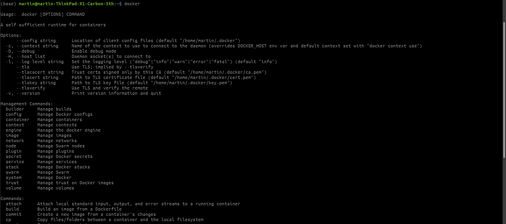
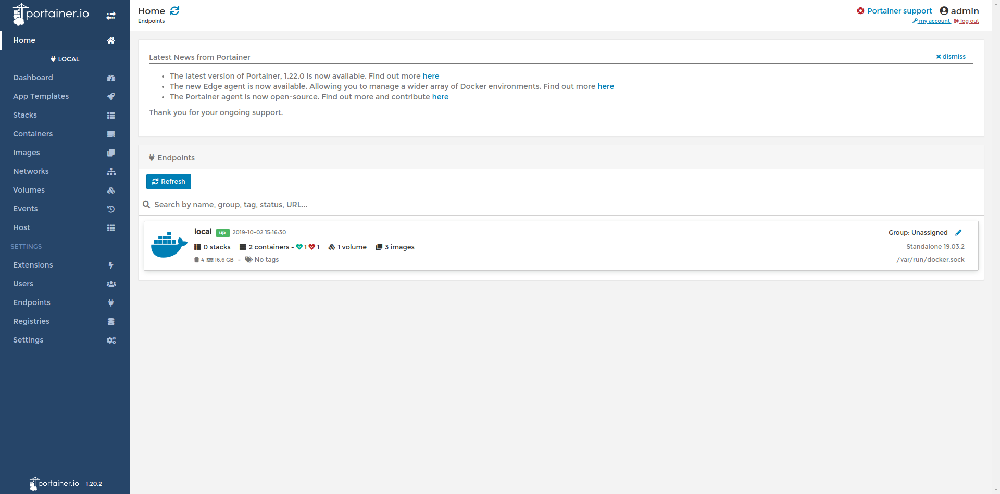

## TEMG 4000 UBS Cash Eq Latency Tracking Application Workshop

### A. Project Pre-requisites

1. Splunk

	* # What is Splunk? 

		> Splunk is a digital platform that makes machine data accessible, usable, and valuable for everyone. It is an advance technology which is potent and scalable in nature, and is effectively able to search and index log data in the system. 
		> 
		> Moreover, it analyzes machine generated data in real-time to provide operational intelligence. As there is exponential growth in IT and its machines, handling data is one big challenge where Splunk plays very vital role. The very features of Splunk is are as follows:
		> 
		> * It deals with the data which is complex to understand.
		> * It manages data which is in unstructured format.
		> * It deals with data which is not useful for any analysis and visualization.
		* Need of Splunk
		
			Take a look at the below mentioned picture to get an idea of how machine data looks like:

			

			You can simply let it do all the dirty work for you i.e. data processing. After extracting the relevant data, it will be a lot more easier to locate the problems. Real time processing is its biggest selling point, as it is the bottleneck of data movement. Apart from this, there are many advantages associated with Splunk. Kindly take a look at the following points given below:

			* It is a kind of Google for log file browsing. 
			* Searches using simple terms with search processing language (SPL).
			* Splunk system has direct storage facility, which means there’s no backend storage required.
			* You can input data in any format i.e. json, .csv, or any other format.
			* You can assign Alerts/Events in Splunk.
			* You can make a precise estimation of the resources you need to scale up the infrastructure.
			* The biggest achievement of Splunk is that it has never encountered a single failure. Apart from this, it has many other impressive features like easy installation, easy scalability, retention without losing granularity, etc. Moreover, Splunk behaviour analytics allows it to spot threats that arise due to user behaviour.

		* To get more comprehensive training for splunk:

			https://www.splunk.com/en_us/training/learning-path/courses-for-app-developers/overview.html

2. Github

	* Setup a **Private** Github repository now. Invite other members after setting it up.

3. Trello

	* Setup a Trello page for progress tracking and work allocation. There are bascially 3 columns, "Todo", "Work In Progress", "Done" to keep track of the status of the tasks. You might get into other agile concepts which will be discussed later.

4. Development Cycle

	* Agile methodology: https://www.agilealliance.org/agile101/

		Agile vs Waterfall

| Agile                                                                                                                                                                           | Waterfall                                                                                                                              |
|---------------------------------------------------------------------------------------------------------------------------------------------------------------------------------|----------------------------------------------------------------------------------------------------------------------------------------|
| It separates the project development lifecycle into sprints.                                                                                                                    | Software development process is divided into distinct phases.                                                                          |
| It follows an incremental approach                                                                                                                                              | Waterfall methodology is a sequential design process.                                                                                  |
| Agile methodology is known for its flexibility.                                                                                                                                 | Waterfall is a structured software development methodology so most times it can be quite rigid.                                        |
| Agile can be considered as a collection of many different projects.                                                                                                             | Software development will be completed as one single project.                                                                          |
| Agile is quite a flexible method which allows changes to be made in the project development requirements even if the initial planning has been completed.                       | There is no scope of changing the requirements once the project development starts.                                                    |
| Agile methodology, follow an iterative development approach because of this planning, development, prototyping and other software development phases may appear more than once. | All the project development phases like designing, development, testing, etc. are completed once in the Waterfall model.               |
| Test plan is reviewed after each sprint                                                                                                                                         | The test plan is rarely discussed during the test phase.                                                                               |
| Agile development is a process in which the requirements are expected to change and evolve.                                                                                     | The method is ideal for projects which have definite requirements and changes not at all expected.                                     |
| In Agile methodology, testing is performed concurrently with software development.                                                                                              | In this methodology, the "Testing" phase comes after the "Build" phase                                                                 |
| Agile introduces a product mindset where the software product satisfies needs of its end customers and changes itself as per the customer's demands.                            | This model shows a project mindset and places its focus completely on accomplishing the project.                                       |
| Agile methdology works exceptionally well with Time & Materials or non-fixed funding. It may increase stress in fixed-price scenarios.                                          | Reduces risk in the firm fixed price contracts by getting risk agreement at the beginning of the process.                              |
| Prefers small but dedicated teams with a high degree of coordination and synchronization.                                                                                       | Team coordination/synchronization is very limited.                                                                                     |
| Products owner with team prepares requirements just about every day during a project.                                                                                           | Business analysis prepares requirements before the beginning of the project.                                                           |
| Test team can take part in the requirements change without problems.                                                                                                            | It is difficult for the test to initiate any change in requirements.                                                                   |
| Description of project details can be altered anytime during the SDLC process.                                                                                                  | Detail description needs to implement waterfall software development approach.                                                         |
| The Agile Team members are interchangeable, as a result, they work faster. There is also no need for project managers because the projects are managed by the entire team       | In the waterfall method, the process is always straightforward so, project manager plays an essential role during every stage of SDLC. |

5. Domain Knowledge

	* https://www.investopedia.com/terms/c/cash-equity.asp

	* http://www.stockbroking101.com/what-are-the-three-legs/

### B. Installing Splunk in your computer

* 1\. Download and Install Docker

    * # What is Docker?
    
        Docker is a tool designed to make it easier to create, deploy, and run applications by using containers. Containers allow a developer to package up an application with all of the parts it needs, such as libraries and other dependencies, and ship it all out as one package.
    
    * 1.1\. Signup a DockerHub account
    
        https://hub.docker.com/signup/
     
    * 1.2\. Windows
    
        Follow the link: https://docs.docker.com/docker-for-windows/install/, download the client "Docker Desktop". Docker for Window does not work in Windows 10 Home, try to upgrade windows license to Windows 10 64-bit: Pro, Enterprise, or Education (Build 15063 or later).
        
        * 1.2.1\. Enable Virtualization in BIOS and Hyper-V in Windows 10:
        
            This is a machine specific procedure, basically can refer to this link: https://blogs.technet.microsoft.com/canitpro/2015/09/08/step-by-step-enabling-hyper-v-for-use-on-windows-10/
            
        * 1.2.2\. What if my hardware doesn't support it?
        
            Worse case will be installing a Virtual Machine to host Linux, then run docker inside the virtual machine. The downside will be signigicant performance loss issues, and a lot more works have to be done.
        
    * 1.3\. Mac
        
        * 1.3.1\. Download from stable channel
        
            > System Requirements: Docker for Mac launches only if all of these requirements are met.
            >
            > * Mac hardware must be a 2010 or newer model, with Intel’s hardware support for memory management unit (MMU) virtualization, including Extended Page Tables (EPT) and Unrestricted Mode. You can check to see if your machine has this support by running the following command in a terminal: sysctl kern.hv_support
            >
            > * macOS El Capitan 10.11 and newer macOS releases are supported. At a minimum, Docker for Mac requires macOS Yosemite 10.10.3 or newer, with the caveat that going forward 10.10.x is a use-at-your-own risk proposition.
            >
            > * Starting with Docker for Mac Stable release 1.13, and concurrent Edge releases, we no longer address issues specific to macOS Yosemite 10.10. In future releases, Docker for Mac could stop working on macOS Yosemite 10.10 due to the deprecated status of this macOS version. We recommend upgrading to the latest version of macOS.
            >
            > * At least 4GB of RAM
            >
            > * VirtualBox prior to version 4.3.30 must NOT be installed (it is incompatible with Docker for Mac). If you have a newer version of VirtualBox installed, it’s fine.
        
            https://docs.docker.com/v17.12/docker-for-mac/install/
    *1.4\. Ubuntu
    
        * 1.4.1\. Follow the instruction for the link
        
            https://docs.docker.com/v17.12/install/linux/docker-ce/ubuntu/
            
* 2\. Pull Splunk image

    * 2.1 Docker in your system
    
        Make sure docker is properly installed in your system, if that is the case you will see the following when you enter `docker` in your command terminal.
        
        
        
        There is a more user friendly interface for docker if you do not want to use terminal. Do `docker pull portainer/portainer` and install portainer with the instructions here: https://www.portainer.io/installation/. It looks like this:
        
        
        
        But be aware, portainer and splunk will use port 8000, so you either will have to close portainer when using splunk or change the port for either of the container.
    
    * 2.2 Pull splunk image run the container
    
        First download the splunk image from DockerHub through
        
        `docker pull splunk/splunk`
        
        After finish downloading, execute the following command, replace `<password>` with the your own password with the requirement of Password must contain at least: 8 total printable ASCII character(s).
        
        `docker run -d -p 8000:8000 -e "SPLUNK_START_ARGS=--accept-license" -e "SPLUNK_PASSWORD=<password>" --name splunk splunk/splunk:latest`
   
        If successfully created a container, you would see a hash generated on your screen, to review the hash generated, simply type `docker ps`, the hash it the `CONTAINER ID` of your container
        
        Now go to your browser and enter `localhost:8000`, you should see a splunk login page, the username is `admin` and the password is the one you just chose : `<password>`.
        
* 3\. Now you are good to go to work on the project on Splunk!
        
        